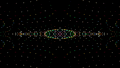
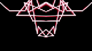
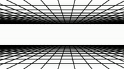

# LOVJ
### A LÖVE VJing framework 

   

LOVJ aims to be a [LÖVE](https://love2d.org/) framework to create, explore, play interactively through LUA scripts in order to create a live-coding VJing setting mainly targeted at live music performances.

Shall be flexible enough to support:
- "1 player" scenarios, with the VJ handling entirely control of the visuals.
- "2+ players" scenario where multiple artists concur to provide signals to control the visuals (through the OSC protocol). 
Here, the VJ may handle the controls and on top, dynamically select and "wire" the external signals to the parameters of choice inside the code.


## TODOs
- Make patch load, savestate save, savestate load, and other major functions, controllable by resources->general variables
- Implement livecoding soft-reset (don't reset screen but reset everything in the soft-reset and patches list).

## Requires
- [LÖVE](https://love2d.org/) version 11.3


## Credits
- [usysrc](https://github.com/usysrc) for their original *LICK* library implementation.
- [rxi](https://github.com/rxi) for their json library.


## Use

- Make sure you have LÖVE (v11.3) installed and its binaries folder added to the PATH environment variable.
- Download/clone this repository.
- Go inside the main folder (with the main.lua script) and run:
```sh
love .
```
This will launch *LOVJ*, which will load the default demo contained in the "demos" folder.

- To test the communication, go into the "test_publisher" folder and run again:
```sh
love .
```
to open a test script to communicate with LOVELive2P.

## Creating scripts
Scripts can be created by using demos as references.
They must be Patches objects, similarly to any LÖVE2D script:
- A patch.init() method called upon love.load()
- A patch.draw() method called upon love.draw()
- A patch.update() method called upon love.update()

## Demos
- Demo 01: Colorful pixel grid
- Demo 02: A "fountain" of balls
- Demo 03: A spinning "tunnel" of balls
- Demo 04: Flashy random rectangles
- Demo 05: Escaping points joint by lines, with a trace effect.
- Demo 06: Animated grid of moving sprites + some new stuff
- Demo 07: Video playback with chroma key
- Demo 08: 80s vector grid effect
- Demo 09: LFO and envelope showcase
- Demo 10: GLSL Raymarcher
- Demo 11: A video playback in loop forward/reverse
- Demo 12: Flashy sprites + sprites + geometry + shaders (overall demo)
- Demo 13: Some more sprites + balls


## MIDI to OSC
[Here](https://github.com/Merutochan/MIDI2OSC) 